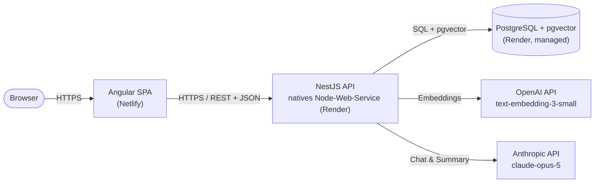
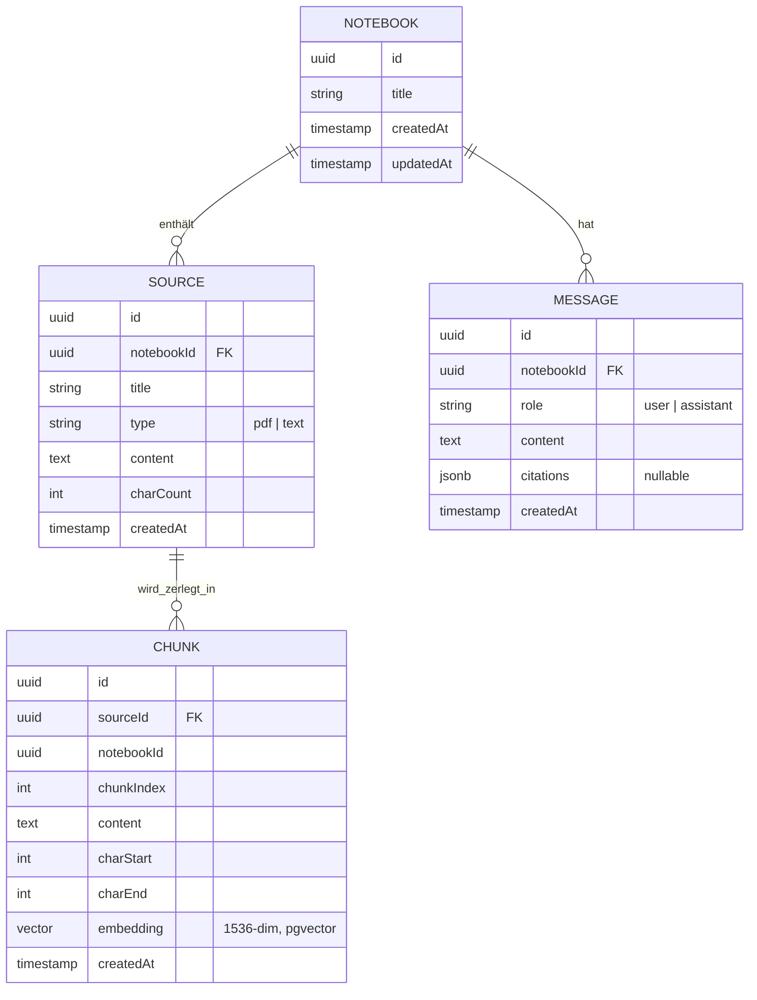
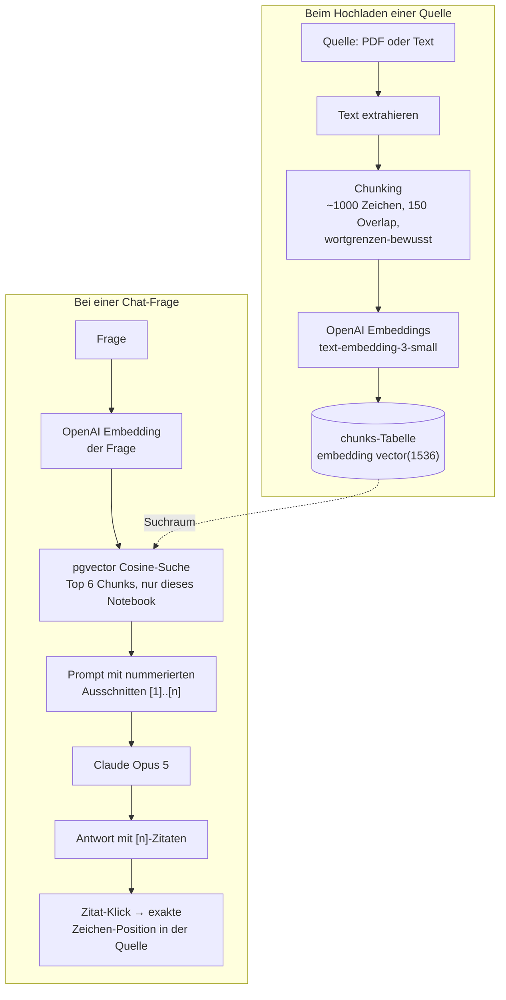

# Architektur

Stand: nach Phase 5 (Live-Deployment). Beschreibt das tatsächlich laufende
System, nicht die ursprüngliche Planung – frühere Annahmen (Docker,
separater Object Storage) wurden im Laufe der Umsetzung bewusst verworfen,
siehe `docs/DECISIONS.md` für die Begründungen.

## Überblick (Deployment-Sicht)



Beide Seiten deployen automatisch bei jedem Push auf `main` (Netlify liest
`netlify.toml`, Render liest `render.yaml`). Kein separater Object Storage:
Quelltexte liegen als extrahierter Klartext direkt in Postgres – für den
Umfang dieser Aufgabe ausreichend und ein Table weniger an Infrastruktur.

## Frontend (Angular 19)

- Standalone Components, kein NgModule-Boilerplate
- State: Signals in einfachen, `providedIn: 'root'`-Services – kein NgRx,
  bewusste Entscheidung gegen Over-Engineering für diesen Umfang
- Eigenes, schlankes Design-System (SCSS-Variablen für Farben/Typografie:
  Papier-Palette, Source Serif 4 + IBM Plex), kein Angular-Material-Default
- Struktur:
  ```
  app/core/                     Services + Models (Notebook, Source, Message …)
  app/features/notebook-list/   Notebook-Übersicht (anlegen/umbenennen/löschen)
  app/features/notebook-shell/  3-Spalten-Ansicht eines Notebooks
    sources-panel/                Quellen hochladen, auflisten, löschen, lesen
    chat-panel/                   RAG-Chat mit klickbaren Zitaten
    studio-panel/                 One-Click-Zusammenfassung, Audio Overview (Platzhalter)
  ```

## Backend (NestJS)

Ein Modul pro fachlichem Bereich, jeweils Controller (REST) → Service
(Logik) → TypeORM-Repository (Postgres):

| Modul | Verantwortung |
|---|---|
| `NotebooksModule` | CRUD für Notebooks |
| `SourcesModule` | Upload (PDF via `pdf-parse`, .txt) und Text-Paste, Speicherung, Löschen. Stößt nach dem Speichern die Indexierung an (siehe unten). |
| `EmbeddingsModule` | Chunking, OpenAI-Embeddings, pgvector-Suche. Wird von `SourcesModule` (Indexierung) und `ChatModule` (Retrieval) importiert, nicht direkt in `AppModule` registriert. |
| `ChatModule` | RAG-Frage/Antwort: Retrieval + Claude-Aufruf, Chatverlauf |
| `StudioModule` | One-Click-Zusammenfassung (ein Claude-Call über alle Quellen eines Notebooks) |

**Resilienz-Prinzip, konsequent durchgezogen:** Beide LLM-Clients (OpenAI,
Anthropic) werden lazy instanziiert – ein fehlender oder ungültiger API-Key
lässt weder den App-Start noch den Quellen-Upload scheitern. Fehler beim
Indexieren einer Quelle werden geloggt statt den Upload fehlschlagen zu
lassen; Fehler beim Chat/der Zusammenfassung liefern eine verständliche
Fehlermeldung statt eines 500ers. Auch das pgvector-Setup beim Start ist in
try/catch gekapselt – ein Problem dort blockiert nicht den App-Start.

## Datenmodell



`embedding` wird nicht über eine TypeORM-Spalten-Decoration verwaltet (kein
natives `vector`-Typ-Mapping), sondern per Rohdaten-SQL beim Start angelegt
(`ALTER TABLE chunks ADD COLUMN IF NOT EXISTS embedding vector(1536)`) und
über Rohdaten-Queries befüllt/abgefragt – der pragmatische Standardweg für
pgvector mit TypeORM.

## RAG-Pipeline (der technische Kern)

Zwei getrennte Abläufe: einmal beim Hochladen einer Quelle (Indexierung),
einmal bei jeder Chat-Frage (Retrieval + Generierung).



Wichtige Designentscheidungen dabei:
- **Zitate sind exakt, nicht nur auf Quellenebene.** Jeder Chunk trägt
  `charStart`/`charEnd` relativ zum Original-Quelltext. Der Chat-Prompt
  weist Claude an, jede Aussage mit `[n]` zu belegen; die Antwort wird nach
  dem Muster `/\[(\d+)\]/g` geparst und jede Zitatnummer auf den passenden
  Chunk (inkl. Zeichen-Offsets) zurückgeführt. Ein Klick auf ein Zitat im
  Frontend öffnet die Quelle und markiert exakt diesen Ausschnitt.
- **System-Prompt erzwingt Quellentreue:** Claude wird angewiesen,
  ausschließlich auf Basis der übergebenen Ausschnitte zu antworten und
  offen zu sagen, wenn die Quellen eine Frage nicht abdecken – kein
  Halluzinieren über die Notebook-Grenzen hinaus.
- **pgvector-Suche ist auf das Notebook skaliert** (`WHERE notebook_id = …`)
  – Chunks anderer Notebooks sind nie im Suchraum.

## Deployment

- **Frontend → Netlify:** `netlify.toml` im Repo-Root baut mit
  `ng build --configuration production` und liefert `dist/frontend/browser`
  mit SPA-Redirect-Regel aus.
- **Backend → Render:** `render.yaml` (Blueprint) legt Postgres-DB und
  Backend als natives Node-Web-Service an (kein Docker – siehe
  `docs/DECISIONS.md` für die Begründung). Build: `npm install && npm run
  build`, Start: `npm run start:prod`.
- **DB-Verbindung:** Render stellt eine `DATABASE_URL` bereit
  (private Netzwerk-URL); `AppModule` nutzt sie, wenn gesetzt, sonst die
  einzelnen `DB_*`-Variablen für lokale Entwicklung.
- **CORS:** `FRONTEND_ORIGIN` env var auf dem Backend beschränkt erlaubte
  Origins auf die Netlify-URL.
- **pgvector:** Render-Postgres unterstützt die Extension nativ (ab
  Postgres 13, kein manueller Schritt) – die App legt sie beim Start selbst
  an (`CREATE EXTENSION IF NOT EXISTS vector`).

## Bewusste Vereinfachungen (für das Loom-Video relevant)

- Kein volles Auth-System in der ersten Version – Fokus liegt auf
  RAG-Qualität und UI, nicht auf User-Management
- Kein separater Object Storage – Quelltexte liegen direkt in Postgres
- Kein Nx-Monorepo – ein Repo mit zwei Ordnern reicht für diesen Umfang und
  ist für Reviewer einfacher zu lesen
- State-Management bewusst simpel gehalten (Signals statt NgRx) – Umfang der
  App rechtfertigt den zusätzlichen Overhead nicht
- Kein eigener VPS/nginx-Reverse-Proxy, obwohl im Alltag genutzt – für diese
  zeitkritische Aufgabe war verlässliches Managed-Hosting (Render) die
  bewusstere Wahl als Ops-Aufwand für Server-Setup
- Kein Docker-Image fürs Backend, obwohl ursprünglich geplant – Render kann
  Node-Projekte direkt bauen, ein Dockerfile hätte hier nur zusätzliche
  Wartungsfläche ohne Mehrwert bedeutet (keine nativen Abhängigkeiten im
  Backend)
- Audio Overview (Zwei-Stimmen-TTS) bewusst nicht umgesetzt – Aufwand für
  TTS-Integration steht in keinem Verhältnis zum Nutzen fürs Demo-Video
